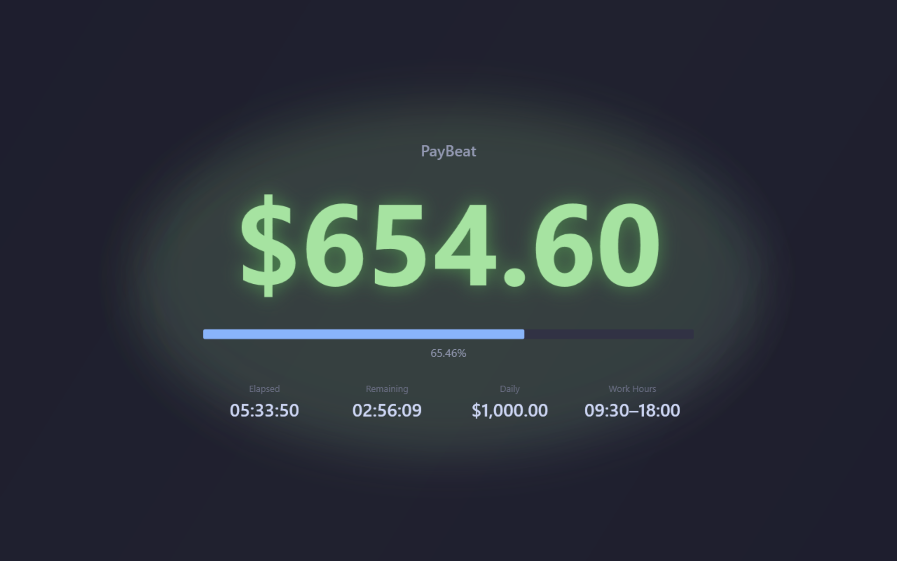
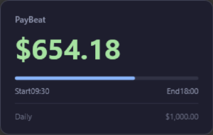

# PayBeat

[](https://github.com/coldhighsun/PayBeat/actions/workflows/ci.yml)
[](https://github.com/coldhighsun/PayBeat/releases/latest)
[](https://github.com/coldhighsun/PayBeat/releases)
[](LICENSE)

Real-time salary progress widget for Windows

---

## Introduction

PayBeat is a borderless, always-on-top Windows widget that shows your real-time daily earnings down to the second. It lives in a corner of your screen and stays out of your way.

## Features

- Linearly calculates earnings per second from your daily salary and work hours
- Four display modes (None / Normal / Mini / Flex) — double-click to open Settings
- Flex mode is a fullscreen "show-off" view with a huge earnings figure, full workday stats, and a decorative animated background
- Each mode remembers its last position independently, with multi-monitor support
- System tray icon with a context menu (display mode, Settings, About, Exit); left-click brings the widget to the front with a brief scale-up flash
- Global hotkey to show / hide all windows (default `Ctrl+Alt+X`)
- Optional lunch break deduction and weekend earnings
- Tray balloon notifications for an end-of-day reminder and earnings milestones
- English and Simplified Chinese UI, auto-detected from the OS locale
- Configurable opacity, refresh interval, and currency symbol
- Optional Windows startup registration

## Screenshots

| Flex | Normal | Mini |
|------|--------|------|
|  |  |  |

## Requirements

- Windows 10 / 11 (x64)
- [.NET 10 Desktop Runtime](https://dotnet.microsoft.com/download/dotnet/10.0)

## Build

```bash
# Build
dotnet build

# Run
dotnet run --project src/PayBeat.App/PayBeat.App.csproj

# Publish (single file)
dotnet publish src/PayBeat.App/PayBeat.App.csproj -c Release
```

Output goes to `artifacts/bin/PayBeat.App/release/`.

## Usage

1. On launch, the widget appears in the bottom-right corner
2. **Double-click** the widget to open Settings
3. **Drag** the widget anywhere; position is saved on exit
4. **Right-click** for a context menu with Settings and About
5. Use the **tray icon** for the same menu, plus display mode switching and Exit — left-click it to bring the widget to the front with a brief scale-up flash
6. Enter your daily salary, work hours, and currency symbol in Settings — changes apply immediately

## Settings Reference

| Option | Default | Description |
|--------|---------|-------------|
| Daily salary | 500 | Pre-tax gross salary per workday (decimals supported, max 99,999,999) |
| Work start | 09:00 | Time when earnings begin accruing |
| Work end | 18:00 | Time when earnings are capped at the daily total |
| Currency symbol | ¥ | Prefix shown before the amount |
| Display mode | Normal | Initial widget size (None / Normal / Mini / Flex) |
| Refresh interval | 1 s | UI update frequency (1–60 seconds) |
| Opacity | 1.0 | Window opacity when the mouse is not hovering (0.1–1.0) |
| Global hotkey | Ctrl+Alt+X | Toggle visibility of all windows |
| Run at startup | Off | Launch automatically when Windows starts |
| Deduct lunch break | Off | Excludes a daily break window from earnings (default 12:00–13:00) |
| Earn on weekends | Off | When off, Saturdays and Sundays earn nothing |
| End-of-day reminder | Off | Tray balloon a configurable number of minutes before work end (default 5) |
| Milestone notifications | Off | Tray balloon each time earnings cross an amount increment (default ¥100) |

## License

MIT

---

## 简介

PayBeat 是一款 Windows 桌面悬浮组件，以秒为单位实时显示当天已挣到的工资。  
窗口无边框、始终置顶，不占用任务栏，适合放在屏幕角落随时瞥一眼。

## 功能

- 根据日薪和工作时段，每秒线性计算已赚金额
- 四种显示模式（None / Normal / Mini / Flex），双击打开设置
- Flex 模式为全屏"炫耀"视图，超大金额数字、完整工时统计，配有动态背景动画
- 每种模式独立记忆上次所在位置（支持多显示器）
- 系统托盘图标，右键菜单可切换显示模式、打开设置 / 关于、退出；左键点击会将悬浮窗置于最前并闪烁放大提示
- 全局热键一键显示 / 隐藏（默认 `Ctrl+Alt+X`）
- 可选午休扣除时段，可选周末计薪
- 托盘气泡通知：下班提醒、赚钱里程碑提醒
- 支持中英文界面，随系统语言自动切换
- 可设置透明度、刷新间隔、货币符号
- 支持开机自启

## 界面截图

| Flex | Normal | Mini |
|------|--------|------|
|  |  |  |

## 系统要求

- Windows 10 / 11（x64）
- [.NET 10 Desktop Runtime](https://dotnet.microsoft.com/download/dotnet/10.0)

## 构建

```bash
# 构建
dotnet build

# 运行
dotnet run --project src/PayBeat.App/PayBeat.App.csproj

# 发布（单文件）
dotnet publish src/PayBeat.App/PayBeat.App.csproj -c Release
```

产物输出至 `artifacts/bin/PayBeat.App/release/`。

## 使用

1. 启动后，悬浮窗出现在屏幕右下角
2. **双击**窗口打开设置界面
3. **拖拽**窗口到任意位置，退出时自动保存
4. **右键**打开菜单，可进入设置或关于页面
5. **托盘图标**提供同样的菜单，另可切换显示模式、退出程序；左键点击会将悬浮窗置于最前并闪烁放大提示
6. 在设置中填写日薪、工作时段、货币符号，保存后立即生效

## 设置说明

| 选项 | 默认值 | 说明 |
|------|--------|------|
| 日薪 | 500 | 每个工作日的税前薪资（支持小数，最大 99,999,999） |
| 上班时间 | 09:00 | 开始计薪的时刻 |
| 下班时间 | 18:00 | 薪资封顶的时刻 |
| 货币符号 | ¥ | 显示在金额前的符号 |
| 显示模式 | Normal | 初始显示模式（None / Normal / Mini / Flex） |
| 刷新间隔 | 1 秒 | 界面更新频率（1–60 秒） |
| 透明度 | 1.0 | 鼠标不悬停时的窗口不透明度（0.1–1.0） |
| 全局热键 | Ctrl+Alt+X | 显示 / 隐藏全部窗口 |
| 开机自启 | 关 | 登录 Windows 后自动启动 |
| 扣除午休 | 关 | 从计薪时段中排除一段每日午休时间（默认 12:00–13:00） |
| 周末计薪 | 关 | 关闭时，周六、周日不计薪 |
| 下班提醒 | 关 | 下班前若干分钟发送托盘气泡提醒（默认 5 分钟） |
| 里程碑提醒 | 关 | 每赚够一定金额发送托盘气泡提醒（默认 ¥100） |
